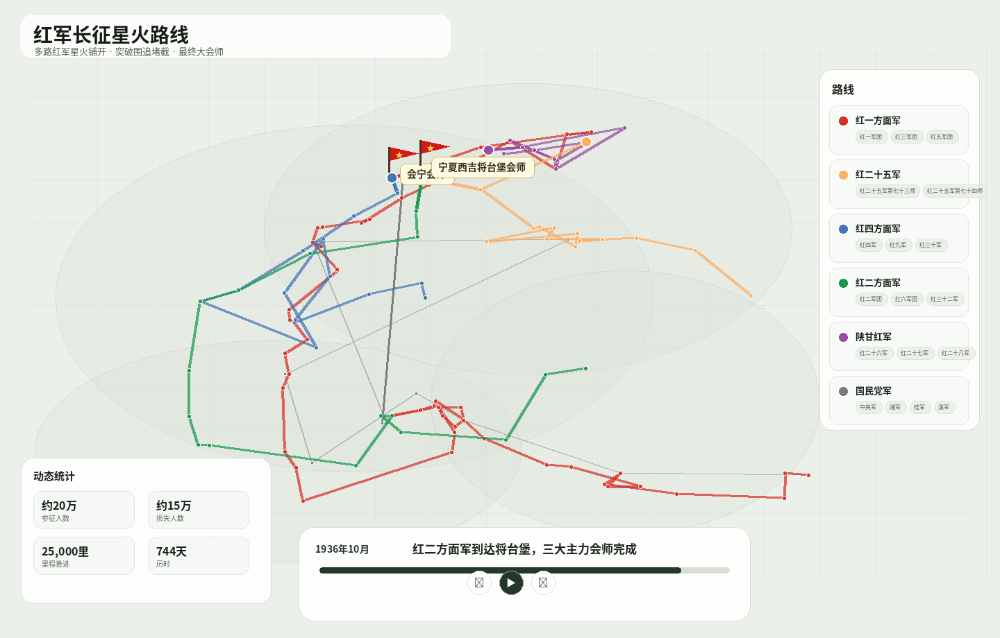
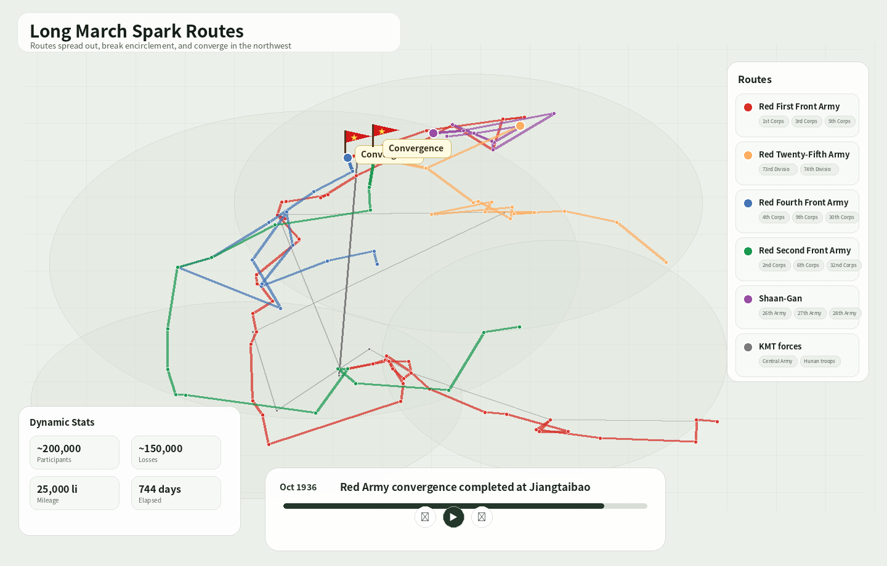

# 红军长征星火路线



一个以“星火铺开、分路前进、最终会师”为叙事逻辑的红军长征交互式路线项目。项目支持多路红军独立行进、敌军围追堵截示意线、人物事迹、战役会议、会师节点、动态统计与《七律·长征》诗句触发效果。

## 功能特性

- **多路线并行**：红一方面军、红二十五军、红四方面军、红二方面军、陕甘红军分别独立连线，国民党军作为半透明灰色追堵线。
- **全局时间播放**：底部时间轴按事件时间顺序推进，但地图连线只连接同一路线的连续节点。
- **会师红旗特效**：凡涉及会师的事件，地图上会浮现红旗，经过淡入、轻微抖动、静止、淡出后继续播放。
- **统一军团颜色**：每一路线固定颜色，人物、战役、会议、牺牲等事件都继承所在路线颜色。
- **下属部队展示**：右侧路线面板展示各路红军下属部队，采用小型标签，不参与勾选筛选。
- **动态统计**：参征人数、损失人数、胜利节点、歼俘敌、里程推进、历时等随时间推进动态变化。
- **中英文版本**：中文首页 `index.html`，英文页面 `index-en.html`，也可在页面右上角切换语言。
- **本地数据编辑器**：后台可编辑事件和主体，并支持导出 JSON。

## 快速启动

Windows 用户直接双击：

```bat
start_server.bat
```

CMD 会显示：

```text
Chinese home page:
http://localhost:8000/

English page:
http://localhost:8000/index-en.html

Admin panel:
http://localhost:8000/admin/index.html
```

macOS / Linux 用户可运行：

```bash
./start_server.sh
```

## 数据维护方式

推荐编辑表格源文件，而不是直接手写 JSON：

```text
data_edit/events.csv      # 事件主表
data_edit/subjects.csv    # 主体、路线、颜色、下属部队
data_edit/sources.csv     # 资料来源，前台不显示
data_edit/metadata.csv    # 项目标题、时间范围等
```

编辑后运行：

```bash
python tools/build_json_from_tables.py
```

脚本会生成：

```text
data/long_march_events.json
```

## 日期格式

表格中统一使用 `YYYYMMDD`，例如：

```text
19350115
```

生成 JSON 时会自动转换为：

```text
1935-01-15
```

## 目录结构

```text
.
├── index.html                    # 中文首页
├── index-en.html                 # 英文页面
├── css/style.css                 # 前台样式
├── js/app.js                     # 前台交互逻辑
├── data/long_march_events.json   # 前台读取的数据文件
├── data_edit/                    # 人工维护表格
├── admin/                        # 本地数据编辑器
├── tools/                        # 表格转 JSON 脚本
├── docs/screenshot.png           # README 截图
└── start_server.bat              # Windows 一键启动
```

## 注意事项

- 敌军路线是概括性叙事层，用于表现围追堵截压力，不代表精确军事部署图。
- 动态统计采用“史实口径 + 节点累积估算”的方式，无法精确逐日还原的指标会以约数呈现。
- 前台不显示参考来源，但 `sourceIds` 会保留在数据中，方便后续审校。

---

# Long March Spark Routes



An interactive Long March route project built around the narrative logic of scattered revolutionary “sparks,” multiple marching columns, pressure from pursuit and blockade, and final convergence in the northwest.

## Features

- **Parallel route layers**: Red First Front Army, Red Twenty-Fifth Army, Red Fourth Front Army, Red Second Front Army, and the Shaanxi-Gansu Red Army are drawn as separate routes. Nationalist pursuit and blockade are shown as a semi-transparent grey layer.
- **Global timeline, route-specific lines**: Events play in chronological order, while map lines only connect consecutive nodes within the same route.
- **Convergence flag effect**: Every convergence event triggers a red flag animation with fade-in, subtle shake, a two-second hold, and fade-out before playback continues.
- **Route-based color system**: Each route keeps one consistent color. Battles, meetings, sacrifices, people-related events, and other nodes inherit the color of their route.
- **Sub-unit display**: The right-side route panel lists smaller sub-units as compact tags without adding extra checkboxes.
- **Dynamic statistics**: Participants, losses, victory nodes, enemy defeated, mileage, and elapsed time update as the timeline advances.
- **Bilingual pages**: Chinese page at `index.html`, English page at `index-en.html`, plus an in-page language switcher.
- **Local data editor**: The admin panel allows editing events and subjects, then exporting JSON.

## Quick Start

On Windows, double-click:

```bat
start_server.bat
```

The CMD window will print:

```text
Chinese home page:
http://localhost:8000/

English page:
http://localhost:8000/index-en.html

Admin panel:
http://localhost:8000/admin/index.html
```

On macOS / Linux:

```bash
./start_server.sh
```

## Editing Data

Edit the table files instead of hand-writing JSON:

```text
data_edit/events.csv      # Main event table
data_edit/subjects.csv    # Routes, colors, sub-units
data_edit/sources.csv     # Source records, kept hidden in the front end
data_edit/metadata.csv    # Project metadata
```

Then run:

```bash
python tools/build_json_from_tables.py
```

The generated application data will be written to:

```text
data/long_march_events.json
```

## Date Format

Use `YYYYMMDD` in CSV files, for example:

```text
19350115
```

The build script converts it to ISO date format in JSON:

```text
1935-01-15
```

## Notes

- The enemy route is a schematic narrative layer, not a precise operational deployment map.
- Dynamic statistics combine historical conventions with event-level accumulation and are displayed as approximate values where exact daily reconstruction is not possible.
- Source IDs remain in the data for later audit, but references are intentionally hidden from the front end.
