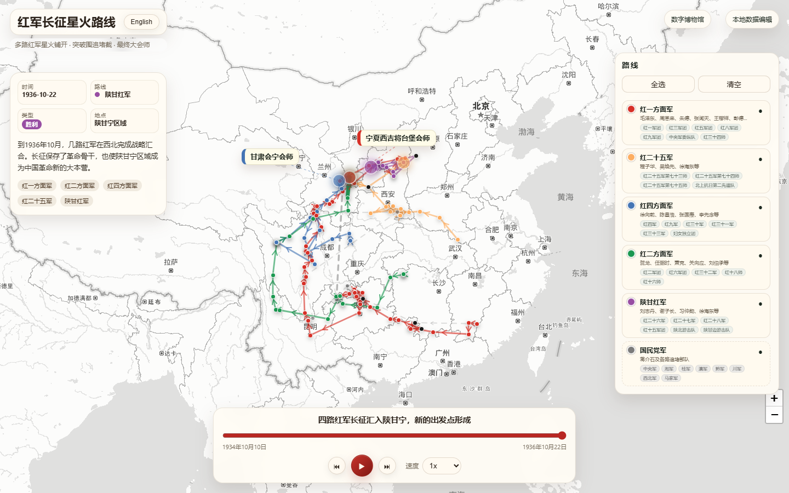
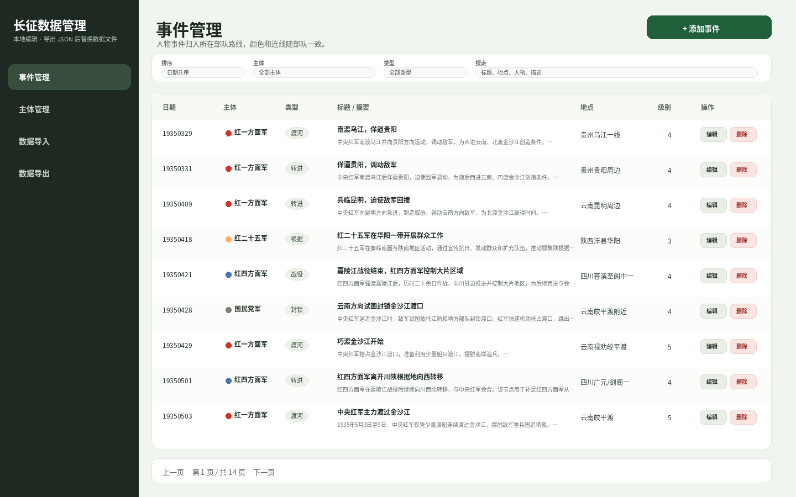
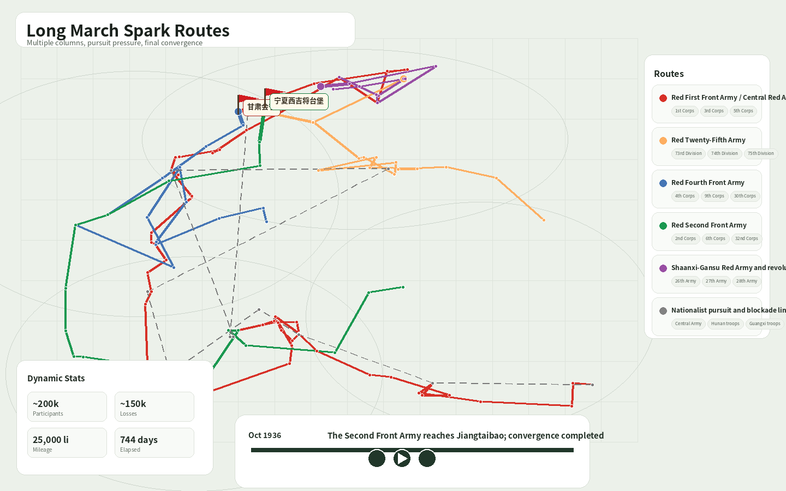

# 红军长征星火路线

一个以“星火铺开、分路前进、最终会师”为叙事逻辑的红军长征交互式路线项目。项目强调多路红军各自成线、全局时间顺序播放、同一路线独立连线，并通过会师红旗、人物事迹、战役会议、敌军围追堵截示意线，呈现长征过程中的艰险、牺牲与汇流。



## 为什么值得 Star

这个项目不是一张静态长征路线图，而是一套可继续扩展的红色数字策展原型：

- 它把长征拆成可维护的数据表，事件、人物、地点、部队、来源都可以继续增长。
- 它同时提供路线地图和线上博物馆，两种入口服务不同阅读方式。
- 它保留资料来源和可信度字段，适合继续做史实审校、课程展示、地方红色资源整理或数字人文实验。
- 它可以从本地研究材料、公开网页、游戏文本抽取结果中整理候选条目，再人工复核后进入正式数据。

当前数据规模：

- `386` 个事件条目，其中 `246` 条来自 补充材料抽取的补充线索
- `67` 个人物档案
- `348` 条人物-事件关联
- `23` 个主体/部队/人物路线层
- `38` 条资料来源
- `40` 个线上图片资产，其中 `34` 个人物已有肖像或历史照片
- `10` 个线上博物馆展厅

## 功能特性

- **多路线并行**：红一方面军、红二十五军、红四方面军、红二方面军、陕甘红军分别独立连线，国民党军作为半透明灰色追堵线。
- **全局时间播放**：底部时间轴按事件时间顺序推进，但地图连线只连接同一路线的连续点位。
- **会师红旗特效**：凡涉及会师的事件，地图上会浮现红旗，经过淡入、轻微抖动、静止、淡出后继续播放。
- **统一军团颜色**：每一路线固定颜色，人物、战役、会议、牺牲等事件都继承所在路线颜色。
- **下属部队展示**：右侧路线面板展示各路红军下属部队，采用小型标签，不额外设置勾选项。
- **首页即博物馆**：`index.html` 会直接进入 `museum.html`；原互动路线地图保留为 `map.html`，英文路线页保留为 `index-en.html`。
- **手机端极简模式**：手机端只保留地图与底部播放条，避免卡片遮挡地图。
- **本地数据编辑器**：后台可编辑事件、主体、颜色、下属部队和统计字段，并支持导出 JSON。
- **数字博物馆**：`museum.html` 以“总序厅 → 路线展板 → 英烈画像墙 → 人物时间线 → 暗线代价 → 战役转折 → 地点档案 → 资料层 → 策展方法 → 纪念空间”的层级组织内容，`red-map` 是第一展厅的核心展板。
- **沉浸式 3D 展厅**：`museum-immersive.html` 在保留原 `museum.html` 页面之外，新增走廊式 Three.js 参观视角。观众可前进、后退、滚轮或键盘漫游；事件、人物与牺牲内容以更克制的展柜式阵列呈现，避免信息漂浮过载。
- **资料总目录**：博物馆内新增人物、地点、事件、部队四类模块列表，可搜索、统计、跳转到人物详情或路线地图。
- **人物时间线**：新增人物档案与人物-事件关联表，可围绕每名英雄烈士沉淀出生、参军、战斗、牺牲、纪念等阶段。
- **Steam 文本融入流程**：提供 Unreal 文本抽取与候选导入脚本，可把本地游戏文本整理为补充路线事件、人物档案和人物-事件关联，而不是直接发布原文。

## 数字博物馆

数字博物馆入口为：

```text
http://localhost:8000/museum.html
```

展馆结构由 `data_edit/museum_halls.csv`、`data_edit/exhibits.csv`、`data_edit/artifacts.csv` 维护；人物内容由 `data_edit/persons.csv` 和 `data_edit/person_events.csv` 维护；线上图片由 `data_edit/visual_assets.csv` 维护。生成后会写入 `data/long_march_events.json` 的 `persons`、`personEvents` 和 `museum` 字段。

博物馆现在包含一个资料总目录：

- **人物模块**：显示身份、生卒、籍贯、所属部队、关联事件数，可跳转到人物时间线。
- **地点模块**：从事件坐标自动聚合地点，显示覆盖事件、时间范围和事件类型。
- **事件模块**：按时间顺序列出全部事件，支持按标题、地点、参与者、部队检索。
- **部队模块**：聚合各路红军、陕甘红军和敌军追堵层，显示关联事件、人物和下属部队。

## 数据管理界面

后台用于本地整理事件、主体、颜色、下属部队和统计字段。它不会直接写入线上文件；编辑后需要导出 JSON 并替换 `data/long_march_events.json`。



## 快速启动

Windows 用户直接双击：

```bat
start_server.bat
```

CMD 会显示：

```text
Digital museum:
http://localhost:8000/museum.html

Immersive 3D museum:
http://localhost:8000/museum-immersive.html

Chinese home page:
http://localhost:8000/

Route map:
http://localhost:8000/map.html

English page:
http://localhost:8000/index-en.html

Admin panel:
http://localhost:8000/admin/index.html
```

macOS / Linux 用户可运行：

```bash
./start_server.sh
```

## 数据维护方式

推荐编辑表格源文件，而不是直接手写 JSON：

```text
data_edit/events.csv      # 事件主表
data_edit/subjects.csv    # 主体、路线、颜色、下属部队
data_edit/persons.csv     # 人物档案
data_edit/person_events.csv # 人物与事件关联
data_edit/museum_halls.csv  # 数字博物馆展厅
data_edit/exhibits.csv      # 展板
data_edit/artifacts.csv     # 档案与物件类展品
data_edit/visual_assets.csv # 线上图片资产
data_edit/sources.csv     # 资料来源，前台不显示
data_edit/metadata.csv    # 项目标题、时间范围等
```

编辑后运行：

```bash
python tools/build_json_from_tables.py
```

脚本会生成：

```text
data/long_march_events.json
```

发布前建议运行：

```bash
python tools/check_project.py
```

该检查会验证 JSON 格式、表格源文件与发布 JSON 是否一致、前后台 JS 语法，以及后台是否仍存在 inline 事件绑定。

## 补充材料抽取

如果要整理本机 Steam 游戏《长征 1934-1936》的文本，可先在 Steam 客户端中进入“管理 → 浏览本地文件”，复制游戏目录路径。这个游戏是 Unreal Engine 4 项目，剧情和数据文本主要在 `.pak` 包内，需要先解包再抽取 FString。

本机已验证路径示例：

```text
D:\Software\Steam\steamapps\common\长征1934-1936\长征1934-1936
```

详细流程见：

```text
docs/STEAM_TEXT_EXTRACTION.md
```

解包后抽取时间线候选：

```cmd
python tools\extract_unreal_text_assets.py "D:\Software\codex\red-map\research_private\steam_longmarch_unpacked\ChangZheng\Content\Data" --exclude-glob "StopWords.*" --out "D:\Software\codex\red-map\research_private\steam_longmarch_unreal_text_timeline" --markdown-limit-per-file 500
```

输出重点文件：

```text
unreal_timeline_candidates.csv  # 日期 + 叙述生成的时间线候选
unreal_text_dump.csv            # 完整抽取文本表
unreal_text_dump.md             # 人工阅读预览
unreal_asset_manifest.csv       # 每个资源文件的抽取数量
```

通用扫描脚本仍然保留：

```text
tools/extract_steam_texts.py
```

这些导出内容需要人工审校版权与史实口径后，再整理进 `events.csv`、`persons.csv`、`person_events.csv` 或展品表。

本仓库已经用 `tools/import_steam_timeline.py` 从 `unreal_timeline_candidates.csv` 中筛选并改写了 `246` 条事件线索，写入 `data_edit/events.csv`；同时补入 `32` 个游戏文本人物、`253` 条人物-事件自动关联和一批已本地化保存的公开图片资产，并新增来源 `src_steam_longmarch_1934_1936`。复用流程：

```cmd
python tools\import_steam_timeline.py
python tools\import_steam_timeline.py --apply
python tools\build_json_from_tables.py
python tools\check_project.py
```

## 日期格式

表格中统一使用 `YYYYMMDD`，例如：

```text
19350115
```

生成 JSON 时会自动转换为：

```text
1935-01-15
```

## 目录结构

```text
.
├── index.html                    # 首页跳转到数字博物馆
├── map.html                      # 中文互动路线地图
├── index-en.html                 # 英文页面
├── museum.html                   # 数字博物馆
├── museum-immersive.html         # Three.js 沉浸式 3D 展厅
├── css/style.css                 # 前台样式
├── css/museum.css                # 数字博物馆样式
├── css/immersive.css             # 沉浸式展厅样式
├── js/app.js                     # 前台交互逻辑
├── js/museum.js                  # 数字博物馆交互逻辑
├── js/immersive.js               # Three.js 沉浸式展厅逻辑
├── data/long_march_events.json   # 前台读取的数据文件
├── data_edit/                    # 人工维护表格
├── admin/                        # 本地数据编辑器
├── tools/                        # 表格转 JSON 与项目检查脚本
├── tools/import_steam_timeline.py # Steam 时间线候选导入脚本
├── docs/STEAM_TEXT_EXTRACTION.md # Steam/Unreal 文本抽取说明
├── docs/readme-home.png          # 首页展示图
├── docs/readme-home-en.png       # 英文首页展示图
├── docs/readme-mobile.png        # 手机端展示图
├── docs/readme-admin.png         # 数据管理展示图
└── start_server.bat              # Windows 一键启动
```

## 发布到 GitHub Pages

1. 将整个项目提交到 GitHub 仓库。
2. 在仓库设置中启用 GitHub Pages。
3. 选择 `main` 分支和根目录 `/` 作为发布源。
4. 发布后访问仓库生成的 Pages 地址即可。

如果线上页面仍显示旧样式，请清理浏览器缓存，或确认最新的 `css/style.css` 和 `docs/` 图片已经提交到仓库。

## 注意事项

- 敌军路线是概括性叙事层，用于表现围追堵截压力，不代表精确军事部署图。
- 前台不显示参考来源，但 `sourceIds` 会保留在数据中，方便后续审校。
- 手机端采用极简展示，主要用于浏览路线和播放时间轴；完整筛选与数据管理建议在桌面端使用。

---

# Long March Spark Routes

An interactive Long March route project built around the narrative logic of scattered revolutionary “sparks,” multiple marching columns, pursuit and blockade, and final convergence in the northwest. The project keeps each Red Army route visually independent while preserving a global chronological playback order.




## Features

- **Parallel route layers**: Red First Front Army, Red Twenty-Fifth Army, Red Fourth Front Army, Red Second Front Army, and the Shaanxi-Gansu Red Army are drawn as separate routes. Nationalist pursuit and blockade are shown as a semi-transparent grey layer.
- **Global timeline, route-specific lines**: Events play in chronological order, while map lines only connect consecutive nodes within the same route.
- **Convergence flag effect**: Every convergence event triggers a red flag animation with fade-in, subtle shake, a short hold, and fade-out before playback continues.
- **Route-based color system**: Each route keeps one consistent color. Battles, meetings, sacrifices, people-related events, and other nodes inherit the color of their route.
- **Sub-unit display**: The right-side route panel lists smaller sub-units as compact tags without adding extra checkboxes.
- **Museum-first home**: `index.html` now opens the digital museum, while the original interactive route map remains available at `map.html`; the English route page remains `index-en.html`.
- **Mobile minimal mode**: On mobile, only the map and bottom playback bar are shown so cards do not cover the route.
- **Local data editor**: The admin panel allows editing events and subjects, then exporting JSON.
- **Digital museum**: `museum.html` organizes the project into a foyer, route exhibit, martyrs wall, person timelines, turning points, place memory, archive sources, and memorial path.
- **Immersive 3D museum**: `museum-immersive.html` keeps the original `museum.html` experience intact and adds a corridor-style Three.js museum. Visitors can move forward or backward with buttons, wheel, or keyboard controls; event, people, and martyr modes use restrained gallery arrays instead of an overloaded floating cloud.
- **Catalog modules**: The museum includes searchable modules for people, places, events, and forces, all derived from the same JSON dataset.
- **Person timelines**: `persons.csv` and `person_events.csv` let each hero or martyr accumulate a structured life timeline.
- **Steam text curation**: `tools/extract_unreal_text_assets.py` extracts local Unreal text candidates, and `tools/import_steam_timeline.py` imports curated low-certainty events, people, person-event links, and image records into the table data.

## Data Editor

The data editor is designed for local curation of events, subjects, route colors, sub-units, and metrics. It does not directly write to deployed files; export JSON and replace `data/long_march_events.json` after editing.


## Quick Start

On Windows, double-click:

```bat
start_server.bat
```

The terminal will show:

```text
Digital museum:
http://localhost:8000/museum.html

Chinese home page:
http://localhost:8000/

English page:
http://localhost:8000/index-en.html

Admin panel:
http://localhost:8000/admin/index.html
```

On macOS / Linux:

```bash
./start_server.sh
```

## Data Maintenance

Edit the table source files instead of manually editing JSON:

```text
data_edit/events.csv      # Event table
data_edit/subjects.csv    # Route subjects, colors, and sub-units
data_edit/persons.csv     # Person profiles
data_edit/person_events.csv # Person-event links
data_edit/museum_halls.csv  # Museum hall hierarchy
data_edit/exhibits.csv      # Exhibit panels
data_edit/artifacts.csv     # Archive and artifact exhibits
data_edit/visual_assets.csv # Online image assets and credits
data_edit/sources.csv     # Sources retained for audit; not shown on the frontend
data_edit/metadata.csv    # Project title and time range
```

Then run:

```bash
python tools/build_json_from_tables.py
```

The script generates:

```text
data/long_march_events.json
```

Before publishing, run:

```bash
python tools/check_project.py
```

The check validates JSON parsing, table-to-JSON consistency, frontend/admin JS syntax, and the admin panel's event binding style.

## Steam Text Extraction

Open the game directory from Steam with `Manage > Browse local files`, then run:

```cmd
python tools\extract_steam_texts.py "D:\SteamLibrary\steamapps\common\Long March 1934-1936" --include-binary
```

The default output directory is `steam_text_dump/`. Review the exported JSONL/Markdown before moving any material into the project data tables.

## GitHub Pages

1. Push the project to a GitHub repository.
2. Enable GitHub Pages in repository settings.
3. Select the `main` branch and root `/` as the publishing source.
4. Open the generated Pages URL after deployment.

If the deployed page still shows old styling, clear browser cache and confirm that the latest `css/style.css` and `docs/` images have been pushed.


